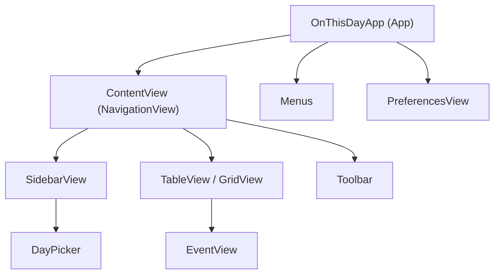

# MacosApp-Tutorial

## OnThisDay 工程结构与SwiftUI使用说明

---

## DEMO截图

---

### 1. View 层级结构与 macOS App 构建流程

#### 1.1 App 启动入口

- **OnThisDayApp.swift** 是应用的入口，采用 `@main` 标记，遵循 `App` 协议。
- 在 `body` 中，使用 `WindowGroup` 创建主窗口，主内容为 `ContentView()`。
- 通过 `.environmentObject(appState)` 注入全局状态对象 `AppState`，实现全局数据共享。
- 注册了自定义菜单（`Menus()`）和设置窗口（`PreferencesView()`）。

#### 1.2 主界面结构

- **ContentView.swift** 是主界面，采用 `NavigationView` 作为根布局，典型的三栏式 macOS 应用结构。
- 左侧为 `SidebarView`（侧边栏），用于事件类型和日期选择。
- 右侧根据 `viewMode`（视图模式）切换为 `TableView`（表格视图）或 `GridView`（网格视图），用于展示事件列表。
- 工具栏（`Toolbar`）和搜索框（`.searchable`）集成在主界面上。

##### 视图层级关系示意

- `SidebarView` 内部集成了 `DayPicker` 用于日期选择。
- `TableView` 和 `GridView` 负责事件列表展示，内部通过 `EventView` 展示单个事件详情。

---

### 2. SwiftUI 在本工程中的使用方式

#### 2.1 状态管理

- 使用 `@StateObject` 创建全局唯一的 `AppState` 实例，作为全局数据源。
- 通过 `@EnvironmentObject` 在各个视图中注入 `AppState`，实现全局状态共享。
- 使用 `@SceneStorage`、`@AppStorage` 实现用户界面状态（如选中的事件类型、日期、视图模式、用户偏好等）的持久化和自动恢复。

#### 2.2 视图声明与组合

- 所有界面均为 SwiftUI 的 `View` 结构体，采用声明式语法描述 UI。
- 视图通过属性（如 `@Binding`、普通变量）接收父视图传递的数据，实现解耦与复用。
- 复杂视图（如 `ContentView`、`SidebarView`、`TableView`、`GridView`）通过组合子视图实现分层结构。

#### 2.3 响应式与异步

- `AppState` 采用 `ObservableObject` 协议，数据变更自动驱动界面刷新。
- 数据加载采用 Swift 的 `async/await`，如 `getDataFor(month:day:)`，保证界面流畅与数据一致性。
- 通过 `.onAppear`、`.onChange` 等修饰符响应生命周期和状态变化。

---

### 3. 视图间数据通信机制

#### 3.1 全局状态共享

- `AppState` 作为全局数据中心，负责事件数据的获取、缓存和分发。
- 通过 `@EnvironmentObject` 注入到所有需要访问全局数据的视图（如 `ContentView`、`SidebarView`、`DayPicker` 等）。

#### 3.2 父子视图数据传递

- 父视图通过属性（如 `@Binding`、普通变量）向子视图传递数据和状态。
  - 例如，`ContentView` 通过 `@SceneStorage` 管理 `eventType`，并通过 `@Binding` 传递给 `SidebarView`。
  - `TableView` 和 `GridView` 通过参数接收事件数据数组。
  - `EventView` 通过参数接收单个事件对象。

#### 3.3 用户偏好与本地存储

- 使用 `@AppStorage` 和 `@SceneStorage`