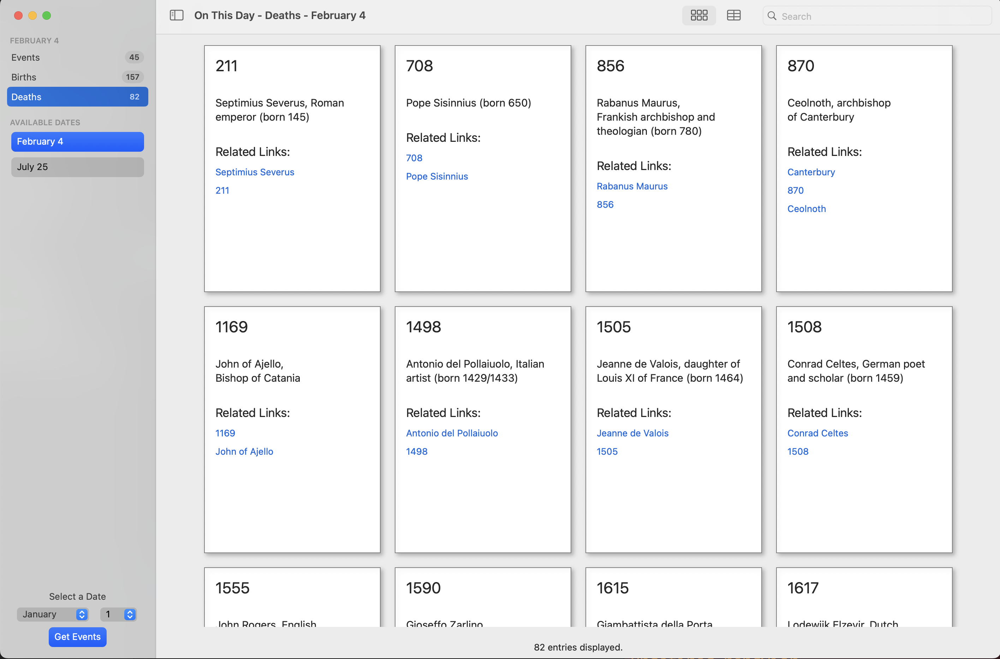
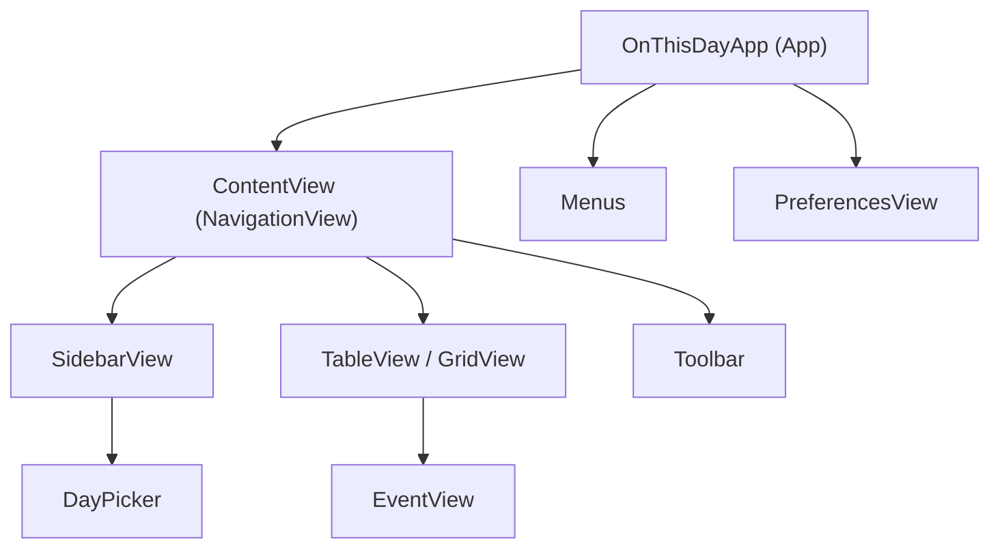
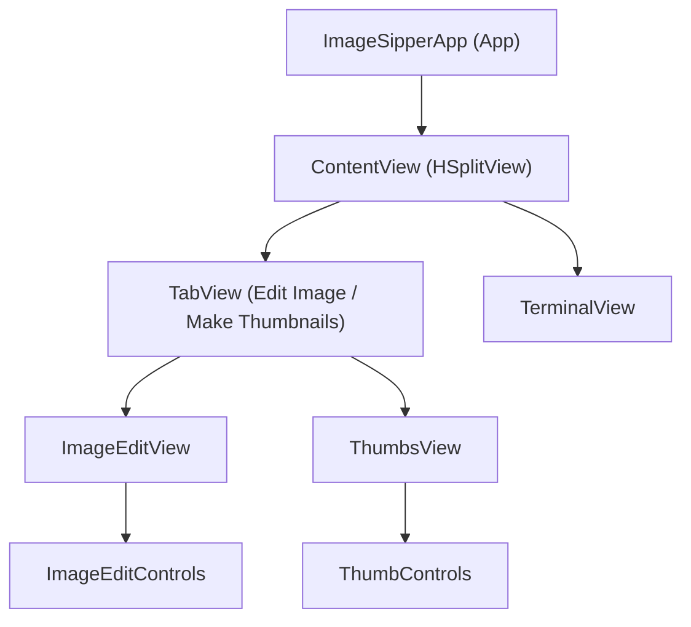
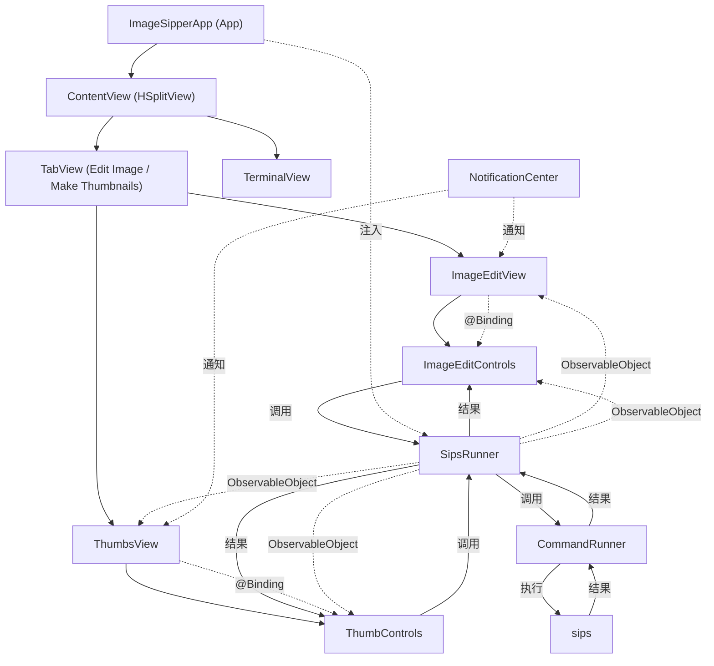

# MacosApp-Tutorial

## OnThisDay 工程结构与SwiftUI使用说明

## DEMO截图

---

### 1. View 层级结构与 macOS App 构建流程

#### 1.1 App 启动入口

- **OnThisDayApp.swift** 是应用的入口，采用 `@main` 标记，遵循 `App` 协议。
- 在 `body` 中，使用 `WindowGroup` 创建主窗口，主内容为 `ContentView()`。
- 通过 `.environmentObject(appState)` 注入全局状态对象 `AppState`，实现全局数据共享。
- 注册了自定义菜单（`Menus()`）和设置窗口（`PreferencesView()`）。

#### 1.2 主界面结构

- **ContentView.swift** 是主界面，采用 `NavigationView` 作为根布局，典型的三栏式 macOS 应用结构。
- 左侧为 `SidebarView`（侧边栏），用于事件类型和日期选择。
- 右侧根据 `viewMode`（视图模式）切换为 `TableView`（表格视图）或 `GridView`（网格视图），用于展示事件列表。
- 工具栏（`Toolbar`）和搜索框（`.searchable`）集成在主界面上。

##### 视图层级关系示意

- `SidebarView` 内部集成了 `DayPicker` 用于日期选择。
- `TableView` 和 `GridView` 负责事件列表展示，内部通过 `EventView` 展示单个事件详情。

---

### 2. SwiftUI 在本工程中的使用方式

#### 2.1 状态管理

- 使用 `@StateObject` 创建全局唯一的 `AppState` 实例，作为全局数据源。
- 通过 `@EnvironmentObject` 在各个视图中注入 `AppState`，实现全局状态共享。
- 使用 `@SceneStorage`、`@AppStorage` 实现用户界面状态（如选中的事件类型、日期、视图模式、用户偏好等）的持久化和自动恢复。

#### 2.2 视图声明与组合

- 所有界面均为 SwiftUI 的 `View` 结构体，采用声明式语法描述 UI。
- 视图通过属性（如 `@Binding`、普通变量）接收父视图传递的数据，实现解耦与复用。
- 复杂视图（如 `ContentView`、`SidebarView`、`TableView`、`GridView`）通过组合子视图实现分层结构。

#### 2.3 响应式与异步

- `AppState` 采用 `ObservableObject` 协议，数据变更自动驱动界面刷新。
- 数据加载采用 Swift 的 `async/await`，如 `getDataFor(month:day:)`，保证界面流畅与数据一致性。
- 通过 `.onAppear`、`.onChange` 等修饰符响应生命周期和状态变化。

---

### 3. 视图间数据通信机制

#### 3.1 全局状态共享

- `AppState` 作为全局数据中心，负责事件数据的获取、缓存和分发。
- 通过 `@EnvironmentObject` 注入到所有需要访问全局数据的视图（如 `ContentView`、`SidebarView`、`DayPicker` 等）。

#### 3.2 父子视图数据传递

- 父视图通过属性（如 `@Binding`、普通变量）向子视图传递数据和状态。
  - 例如，`ContentView` 通过 `@SceneStorage` 管理 `eventType`，并通过 `@Binding` 传递给 `SidebarView`。
  - `TableView` 和 `GridView` 通过参数接收事件数据数组。
  - `EventView` 通过参数接收单个事件对象。

#### 3.3 用户偏好与本地存储

- 使用 `@AppStorage` 和 `@SceneStorage`

---

# ImageSipper 功能与架构说明

## 一、主要功能

1. **图像裁剪与尺寸调整**
   - 支持用户选择本地图片文件，查看图片信息（如尺寸、格式等）。
   - 用户可自定义输入目标宽度、高度、格式（如 PNG、JPEG），一键调整图片尺寸并导出新图片。

2. **批量缩略图制作**
   - 支持选择一个包含多张图片的文件夹，自动识别所有图片文件。
   - 用户可设置缩略图的最大边长，批量生成所有图片的缩略图，并保存到指定文件夹。

3. **系统服务菜单（Service Menu）集成**
   - 支持通过 macOS 系统服务菜单，直接对选中的图片或文件夹进行图片处理操作（如快速缩略图生成、图片调整等）。
   - 通过 `NSApp.servicesProvider` 注册服务，支持跨 App 调用。

---

## 二、整体架构与通信流程

### 1. View 层级结构

- **ImageSipperApp.swift**：应用入口，注入全局 `SipsRunner`，注册系统服务。
- **ContentView.swift**：主界面，左右分栏。左侧为功能区（TabView），右侧为命令行输出（TerminalView）。
- **TabView**：包含“图片编辑（ImageEditView）”和“批量缩略图（ThumbsView）”两个功能页签。
- **ImageEditView**：单张图片的选择、预览与编辑，底部为 `ImageEditControls` 控件区。
- **ThumbsView**：文件夹选择、图片列表展示，底部为 `ThumbControls` 控件区。
- **TerminalView**：显示底层命令行工具（sips）执行的输出信息，便于调试和反馈。

---

### 2. 指令调用流程

- **SipsRunner.swift**：核心逻辑层，负责与 macOS 自带的 `sips` 命令行工具交互，实现图片信息获取、尺寸调整、批量缩略图等功能。
  - `getImageData(for:)`：获取图片元数据。
  - `resizeImage(...)`：调整图片尺寸与格式。
  - `createThumbs(...)`：批量生成缩略图。
- **CommandRunner.swift**：封装 shell 命令执行，异步调用 `sips` 并返回结果。
- **View 层**：通过 `@EnvironmentObject` 注入 `SipsRunner`，各控件通过调用其方法实现图片处理。

---

### 3. 数据通信流程

- **全局状态管理**：`SipsRunner` 作为 `ObservableObject`，在 App 启动时注入到所有视图，实现数据与命令的全局共享。
- **父子视图通信**：如 `ImageEditView` 通过 `@Binding` 传递图片 URL、图片信息等给 `ImageEditControls`。
- **通知机制**：通过 `NotificationCenter`，实现系统服务菜单与主界面的通信（如服务菜单选中图片后自动切换到编辑页并加载图片）。
- **异步任务**：所有图片处理操作均为异步（async/await），保证界面流畅与数据一致性。

---

## 三、系统服务菜单（Service Menu）集成

- 在 `ImageSipperApp.swift` 中通过 `NSApp.servicesProvider = serviceProvider` 注册服务。
- 支持通过 Finder 或其他 App 的“服务”菜单，直接将图片或文件夹发送到 ImageSipper 进行处理。
- 服务菜单触发后，通过通知机制将文件 URL 传递到主界面，自动切换到对应功能页并加载数据。

---

## 四、总结

ImageSipper 采用 SwiftUI + macOS 原生命令行工具（sips）实现，界面简洁，功能聚焦于图片尺寸调整与批量缩略图制作，并通过系统服务菜单实现了与系统的深度集成，极大提升了图片处理的效率与易用性。

---

---

## ImageSipper 架构图

